# Multi-Armed Bandits Homework

### Overview
This notebook implements and empirically compares several classic action-value methods for the k-armed bandit problem (k=10) as described in Sutton & Barto (2nd ed.), Chapter 2.

All experiments use:
- 2000 independent runs
- 1000 time steps per run
- Gaussian reward noise (σ²=1)

### Tasks

#### Incremental Value Estimation & Step-Size Effects  
- ε-greedy (ε=0.1) with sample-average and constant step-sizes α ∈ {0.05, 0.1, 0.2, 0.4}
- Tested on both **stationary** and **non-stationary** (random walk σ=0.01) bandits
- Shows why sample-averages work best when the environment is stationary and why larger constant α is required for tracking non-stationary problems.

#### Exploration-Exploitation Trade-off with ε-Greedy  
- Comparison of ε = 0, 0.01, 0.1 (sample-average updates)
- Demonstrates that pure greedy (ε=0) gets stuck on suboptimal arms while moderate exploration (ε≈0.1) yields the highest long-term reward.

#### Upper Confidence Bound (UCB) vs ε-Greedy  
- ε-greedy (ε=0.1) vs UCB with c = 1 and c = 1.25 (or 2.5 in some runs)
- Plots average reward, % optimal action, and **cumulative regret** (log scale)
- UCB clearly outperforms ε-greedy by achieving lower regret through optimism in the face of uncertainty.

#### Gradient Bandit Algorithm  
- Softmax action preferences with/without average-reward baseline
- α = 0.1 and α = 0.4
- Baseline dramatically reduces variance and improves performance, especially for larger step-sizes.

### Results (insert images below)

| Task | Average Reward | % Optimal Action | Cumulative Regret (Task 3) |
|------|----------------|------------------|----------------------------|
| 1 – Stationary | 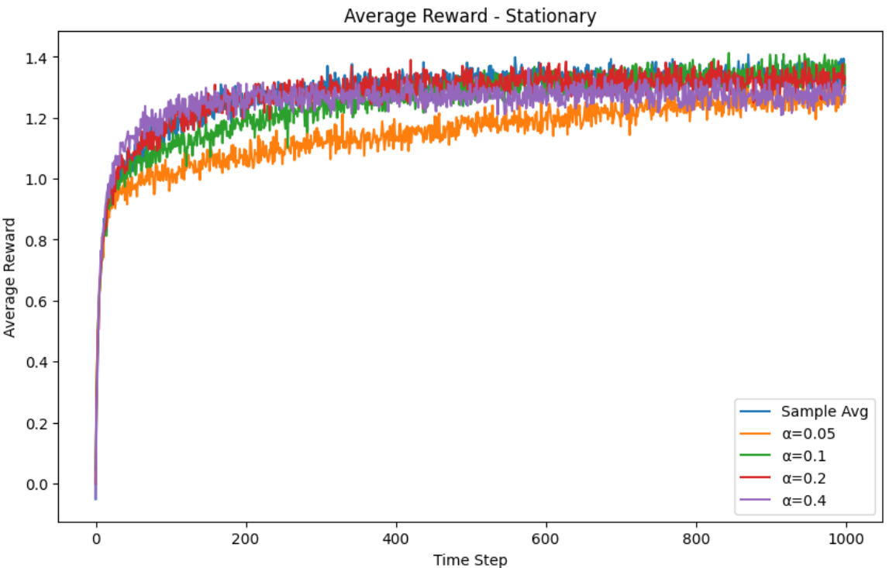 | 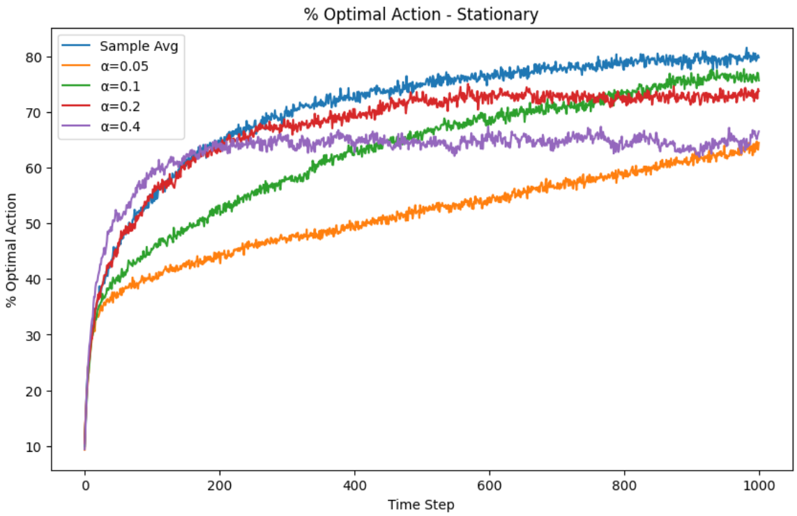 | – |
| 1 – Non-stationary | 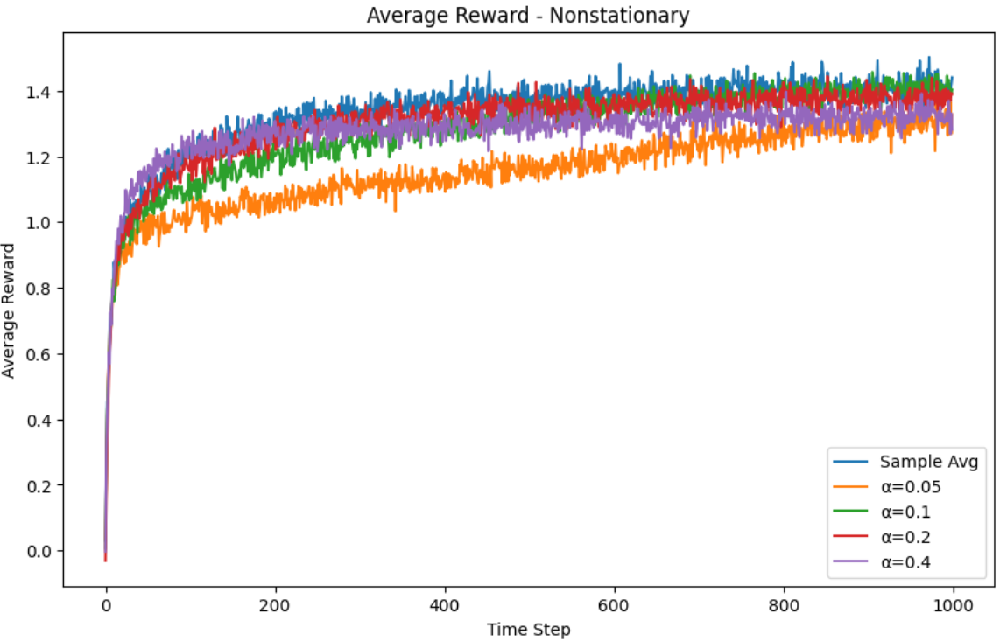 | 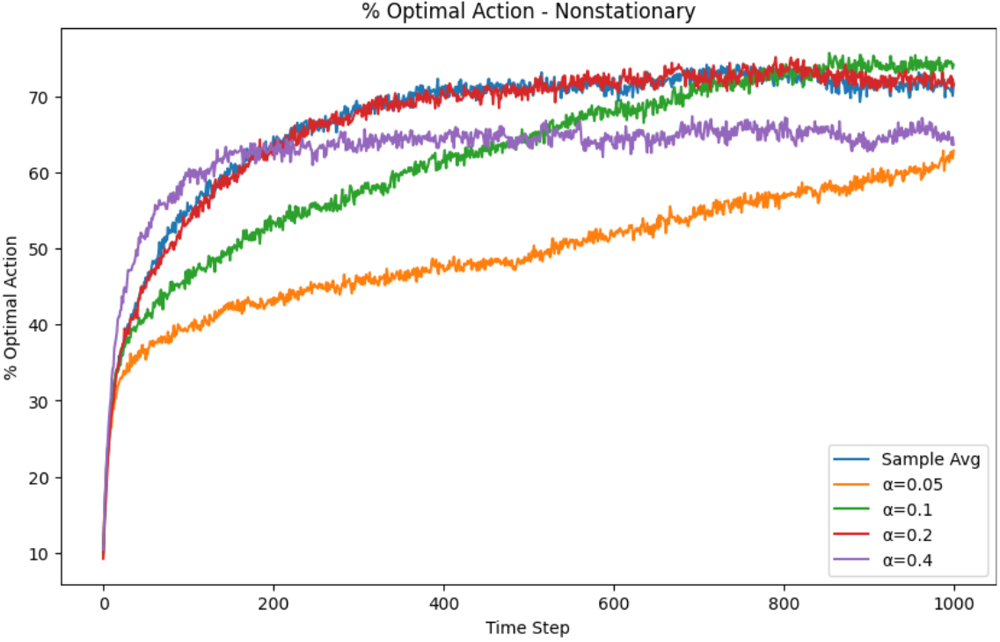 | – |
| 2 – ε comparison | 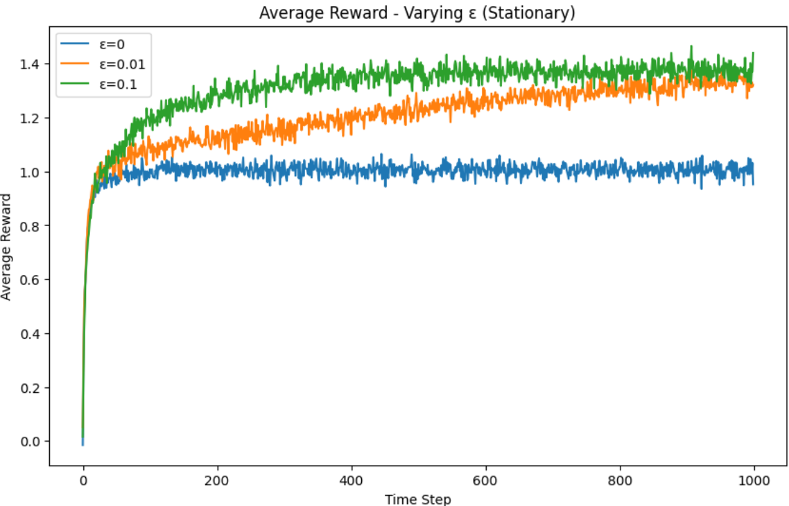 | 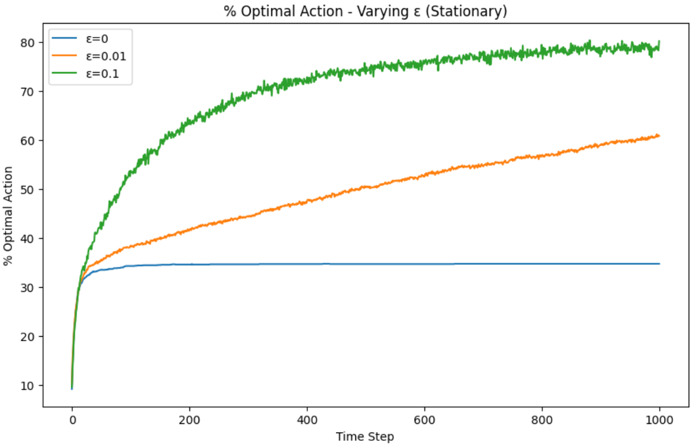 | – |
| 3 – UCB vs ε-greedy | 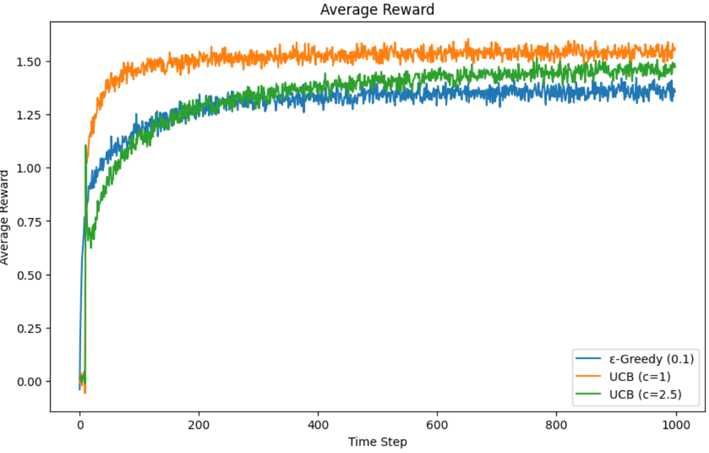 | 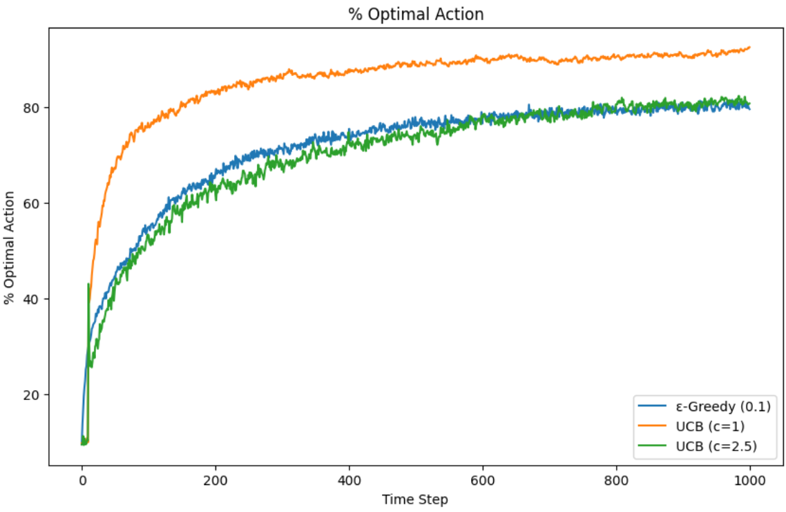 | 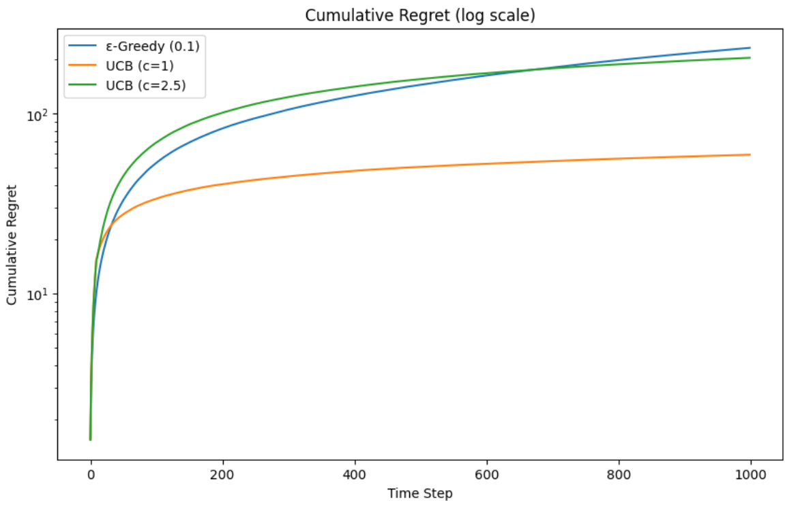 |
| 4 – Gradient bandit | 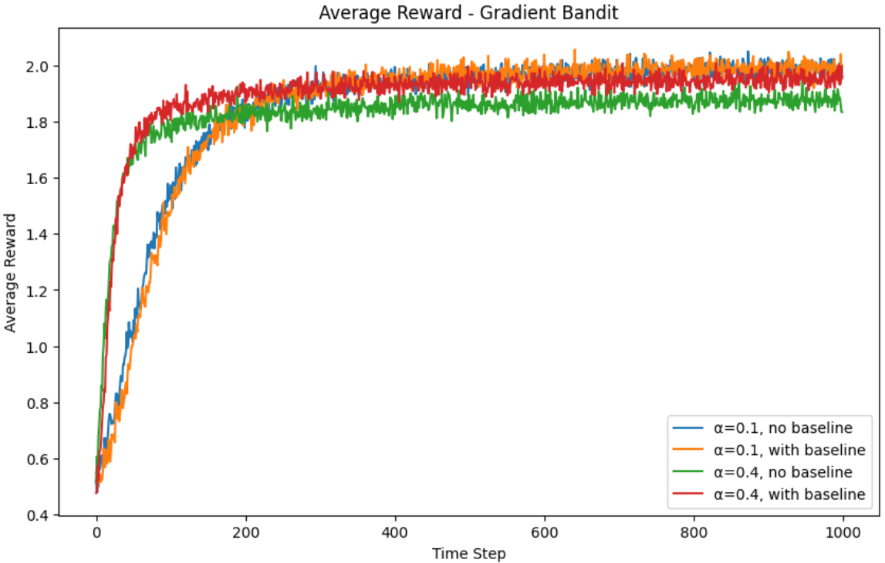 | 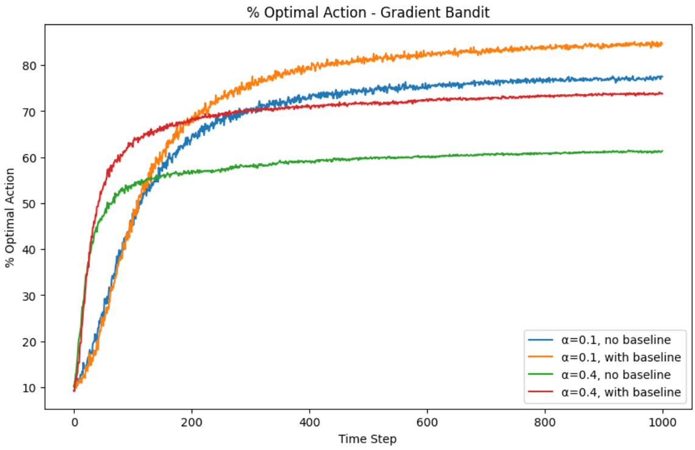 | – |

**Note that results are discussed in the notebook!**
